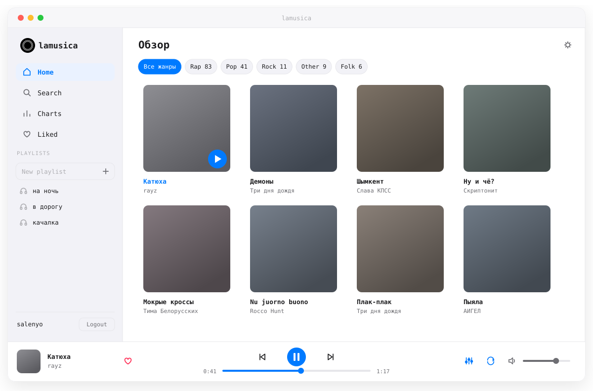

# Rhytmix

Десктопный плеер: поиск и прослушивание из YouTube, SoundCloud, Spotify и
Яндекс.Музыки в одном приложении.

<picture>
  <source media="(prefers-color-scheme: dark)" srcset="docs/preview-dark.svg">
  
</picture>

## Возможности

- Поиск по YouTube, SoundCloud, Spotify и Яндекс.Музыке из одной строки
- Лайки, плейлисты, фильтр по жанрам
- Мировые и региональные чарты, рекомендации по прослушанному
- 10-полосный эквалайзер с пресетами и визуализатор спектра
- Светлая и тёмная темы, свой акцент и фон
- Медиа-клавиши и системный виджет плеера
- Статус в Discord с обложкой и прогрессом — по желанию
- Встроенное обновление

## Установка

| ОС | Файл | Примечание |
|----|------|------------|
| **Windows** | `rhytmix-app_<версия>_x64-setup.exe` | обычный установщик |
| **macOS** | `rhytmix-app_<версия>_universal.dmg` | при первом запуске: правый клик → **Open** |
| **Linux** | `.AppImage`, `.deb` или `.rpm` | AppImage нужно сделать исполняемым: `chmod +x` |
| **Arch Linux** | `rhytmix-app_<версия>_x86_64-linux.tar.gz` | распаковать и запустить `./rhytmix-app` либо `sudo ./install.sh`; зависимости: `pacman -S webkit2gtk-4.1 alsa-lib`. Обновляется вручную |

### [⬇ Скачать последнюю версию](https://github.com/salenyo/rhytmix-releases/releases/latest)

## Обновления

Приложение проверяет обновления при запуске, а в настройках есть кнопка ручной проверки.
Новая версия скачивается и ставится в один клик — вручную качать заново не нужно.

## Аккаунт

Регистрация пока по бета-коду — его выдаёт администратор.

---

Проект в стадии **беты**. Нашли проблему или есть идея —
[заведите issue](https://github.com/salenyo/rhytmix-releases/issues).

